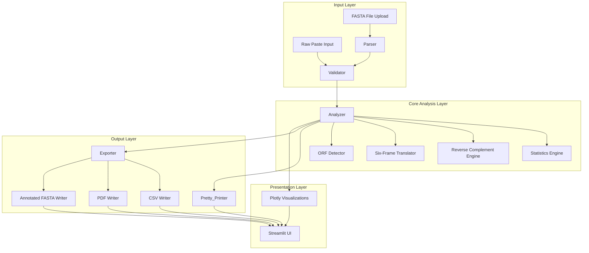

# Design Document: DNA Sequence Analyzer

## Overview

The DNA Sequence Analyzer (DSA) is a Streamlit web application with an optional CLI interface that performs automated DNA sequence analysis. It accepts raw nucleotide strings or FASTA files, computes sequence statistics (GC/AT content, nucleotide counts), generates reverse complements, performs six-frame translation, detects ORFs, renders interactive Plotly charts, and exports results as CSV, PDF, or annotated FASTA.

The application is offline-first — all computation runs locally with no network calls required. The UI applies a futuristic dark biotech aesthetic via custom CSS injection into Streamlit.

### Technology Stack

| Layer | Choice | Rationale |
|---|---|---|
| Web UI | Streamlit ≥ 1.32 | Rapid scientific UI, supports custom CSS injection, file upload, download buttons |
| Sequence logic | Pure Python (no Biopython dependency) | Full control over IUPAC handling, ORF logic, and round-trip correctness; avoids heavy dependency |
| Charts | Plotly ≥ 5.x | Interactive, dark-theme-friendly, embeds cleanly in Streamlit |
| PDF export | ReportLab ≥ 4.x | Mature, offline-capable PDF generation with chart embedding |
| CSV export | Python `csv` stdlib | Zero dependency, precise numeric formatting |
| Property-based testing | Hypothesis ≥ 6.x | Industry-standard PBT library for Python |
| Unit testing | pytest ≥ 8.x | Standard Python test runner |

---

## Architecture

The application follows a layered architecture with clear separation between input handling, core analysis, output formatting, and UI presentation.



### Key Design Decisions

1. **No Biopython dependency**: All sequence logic is implemented in pure Python. This keeps the dependency footprint small, gives full control over IUPAC complement tables, and makes property-based testing straightforward.

2. **Immutable SequenceRecord**: The core data model is an immutable dataclass. Analysis results are computed once and stored in a separate `AnalysisResult` dataclass, preventing accidental mutation.

3. **Separation of Parser and Validator**: The Parser handles FASTA format structure; the Validator handles nucleotide character correctness. This allows the same Validator to be used for both raw paste and FASTA inputs.

4. **CSS injection via `st.markdown`**: Streamlit's `unsafe_allow_html=True` parameter on `st.markdown` is used to inject a single `<style>` block at app startup, overriding all default Streamlit styles.

---

## Components and Interfaces

### Validator

```python
class ValidationResult:
    is_valid: bool
    normalized_sequence: str          # uppercase, whitespace stripped
    invalid_characters: list[str]     # characters not in IUPAC alphabet
    error_message: str | None

class Validator:
    IUPAC_ALPHABET: frozenset[str]    # {A,T,G,C,N,R,Y,S,W,K,M,B,D,H,V}

    def validate(self, raw_input: str) -> ValidationResult: ...
```

- Strips whitespace, uppercases, then checks each character against `IUPAC_ALPHABET`.
- Returns `is_valid=False` with populated `invalid_characters` if any character fails.
- Returns `is_valid=False` with a specific message if input is empty/whitespace-only.

### Parser

```python
@dataclass(frozen=True)
class SequenceRecord:
    header: str          # full header line, excluding leading '>'
    sequence: str        # normalized uppercase sequence string

class ParseResult:
    records: list[SequenceRecord]
    warnings: list[str]   # per-entry warnings for skipped invalid entries
    error: str | None     # fatal error (e.g., malformed file)

class Parser:
    def parse_fasta(self, content: str) -> ParseResult: ...
    def format_fasta(self, records: list[SequenceRecord]) -> str: ...
```

- `parse_fasta` splits on `>` lines, joins multi-line sequences, normalizes to uppercase, validates each entry via `Validator`, skips invalid entries with a warning.
- `format_fasta` produces standard FASTA output (60-char line wrapping).
- Round-trip: `parse_fasta(format_fasta(records))` produces equivalent records.

### Analyzer

```python
@dataclass(frozen=True)
class NucleotideStats:
    length: int
    a_count: int
    t_count: int
    g_count: int
    c_count: int
    ambiguous_count: int
    gc_content: float     # percentage, rounded to 2 decimal places
    at_content: float     # percentage, rounded to 2 decimal places

@dataclass(frozen=True)
class ORFResult:
    frame: str            # "+1", "+2", "+3", "-1", "-2", "-3"
    start: int            # 1-based, relative to forward sequence
    end: int              # 1-based, relative to forward sequence
    length_nt: int
    amino_acid_sequence: str

@dataclass(frozen=True)
class AnalysisResult:
    record: SequenceRecord
    stats: NucleotideStats
    reverse_complement: str
    translations: dict[str, str]   # frame_id -> amino acid string
    orfs: dict[str, ORFResult | None]  # frame_id -> longest ORF or None

class Analyzer:
    def analyze(self, record: SequenceRecord) -> AnalysisResult: ...
    def compute_stats(self, sequence: str) -> NucleotideStats: ...
    def reverse_complement(self, sequence: str) -> str: ...
    def translate_frame(self, sequence: str, offset: int) -> str: ...
    def find_longest_orf(self, sequence: str, frame: str) -> ORFResult | None: ...
```

**IUPAC Complement Table** (used by `reverse_complement`):

```
A↔T, G↔C, N↔N, R↔Y, Y↔R, S↔S, W↔W, K↔M, M↔K, B↔V, D↔H, H↔D, V↔B
```

**Standard Genetic Code** (NCBI Table 1): Full 64-codon lookup table stored as a module-level dict. Ambiguous codons (containing non-ACGT characters) map to `X`. Stop codons map to `*`.

### Exporter

```python
class Exporter:
    def export_csv(self, results: list[AnalysisResult]) -> bytes: ...
    def export_pdf(self, results: list[AnalysisResult],
                   figures: list[go.Figure]) -> bytes: ...
    def export_annotated_fasta(self, results: list[AnalysisResult]) -> str: ...
```

- `export_csv`: Uses `csv.writer` with `StringIO`, returns UTF-8 encoded bytes. Filename generated by caller with `datetime.now().strftime("dsa_report_%Y%m%d_%H%M%S.csv")`.
- `export_pdf`: Uses ReportLab `SimpleDocTemplate`. Charts are rendered to PNG via Plotly's `write_image` (kaleido) and embedded. Falls back gracefully if kaleido is unavailable.
- `export_annotated_fasta`: Appends `|len=N|gc=X.XX|at=X.XX|orf_coords=start-end` to each header.

### Pretty_Printer

```python
class PrettyPrinter:
    def render_summary(self, result: AnalysisResult) -> None: ...
    def render_multi_sequence_table(self, results: list[AnalysisResult]) -> None: ...
```

Renders directly into Streamlit using `st.metric`, `st.dataframe`, `st.expander`, and custom HTML via `st.markdown`.

### Visualizations

```python
class Visualizer:
    COLORS: dict  # {"purple": "#a855f7", "cyan": "#06b6d4", "teal": "#14b8a6", ...}

    def nucleotide_bar_chart(self, stats: NucleotideStats, title: str) -> go.Figure: ...
    def gc_at_pie_chart(self, stats: NucleotideStats, title: str) -> go.Figure: ...
    def sequence_length_histogram(self, results: list[AnalysisResult]) -> go.Figure: ...
```

All figures use `template="plotly_dark"` with background `#0a0a0f` and neon accent colors.

---

## Data Models

### Core Data Flow

```
Raw Input (str | file)
    → Parser / Validator
    → SequenceRecord(header, sequence)
    → Analyzer
    → AnalysisResult(record, stats, reverse_complement, translations, orfs)
    → PrettyPrinter / Visualizer / Exporter
    → UI / Files
```

### SequenceRecord

| Field | Type | Description |
|---|---|---|
| `header` | `str` | FASTA header without `>`, or `"raw_input"` for paste |
| `sequence` | `str` | Normalized uppercase nucleotide string |

### NucleotideStats

| Field | Type | Description |
|---|---|---|
| `length` | `int` | Total character count |
| `a_count` | `int` | Count of 'A' |
| `t_count` | `int` | Count of 'T' |
| `g_count` | `int` | Count of 'G' |
| `c_count` | `int` | Count of 'C' |
| `ambiguous_count` | `int` | Count of non-ACGT IUPAC characters |
| `gc_content` | `float` | `(G+C)/length * 100`, 2 d.p. |
| `at_content` | `float` | `(A+T)/length * 100`, 2 d.p. |

### ORFResult

| Field | Type | Description |
|---|---|---|
| `frame` | `str` | One of `+1, +2, +3, -1, -2, -3` |
| `start` | `int` | 1-based start position on forward strand |
| `end` | `int` | 1-based end position on forward strand |
| `length_nt` | `int` | Length in nucleotides |
| `amino_acid_sequence` | `str` | Translated protein sequence |

### CSV Schema

Columns (in order): `sequence_name`, `length`, `a_count`, `t_count`, `g_count`, `c_count`, `ambiguous_count`, `gc_pct`, `at_pct`, `reverse_complement`, `orf_+1_start`, `orf_+1_end`, `orf_+1_length`, `orf_+1_aa`, `orf_+2_start`, ..., `orf_-3_aa`, `timestamp`.

### File Structure

```
dna_sequence_analyzer/
├── app.py                  # Streamlit entry point
├── cli.py                  # Click-based CLI entry point
├── components/
│   ├── __init__.py
│   ├── validator.py        # Validator class
│   ├── parser.py           # Parser class + SequenceRecord
│   ├── analyzer.py         # Analyzer class + result dataclasses
│   ├── exporter.py         # Exporter class
│   ├── pretty_printer.py   # PrettyPrinter class
│   └── visualizer.py       # Visualizer class
├── styles/
│   └── theme.py            # CSS string constant + inject_css()
├── tests/
│   ├── test_validator.py
│   ├── test_parser.py
│   ├── test_analyzer.py
│   ├── test_exporter.py
│   └── test_properties.py  # Hypothesis property-based tests
└── requirements.txt
```

---

## Correctness Properties

*A property is a characteristic or behavior that should hold true across all valid executions of a system — essentially, a formal statement about what the system should do. Properties serve as the bridge between human-readable specifications and machine-verifiable correctness guarantees.*

### Property 1: Input Normalization to Uppercase

*For any* non-empty string composed of valid IUPAC nucleotide characters in any combination of upper and lowercase, the Validator's normalized output sequence SHALL consist entirely of uppercase characters.

**Validates: Requirements 1.2, 12.4**

---

### Property 2: Valid IUPAC Input Acceptance

*For any* non-empty string composed exclusively of characters from the IUPAC nucleotide alphabet (A, T, G, C, N, R, Y, S, W, K, M, B, D, H, V) in any case, the Validator SHALL return `is_valid=True`.

**Validates: Requirements 1.3**

---

### Property 3: Invalid Character Rejection and Reporting

*For any* string containing at least one character outside the IUPAC nucleotide alphabet, the Validator SHALL return `is_valid=False` and the `invalid_characters` list SHALL contain every distinct non-IUPAC character present in the input.

**Validates: Requirements 1.4**

---

### Property 4: FASTA Round-Trip Preservation

*For any* valid FASTA string, parsing it to produce a list of `SequenceRecord` objects, then formatting those records back to a FASTA string, then parsing again SHALL produce a list of records with sequence data and header values identical to those produced by the first parse.

**Validates: Requirements 2.8, 12.1, 12.2, 12.3**

---

### Property 5: FASTA Entry Count Preservation

*For any* valid FASTA string containing N header entries (all with valid nucleotide sequences), parsing SHALL produce exactly N `SequenceRecord` objects.

**Validates: Requirements 2.2**

---

### Property 6: FASTA Invalid Entry Skipping

*For any* FASTA string containing a mix of valid and invalid sequence entries, parsing SHALL produce records only for the valid entries, and the `warnings` list SHALL contain one warning per skipped invalid entry.

**Validates: Requirements 2.4**

---

### Property 7: Nucleotide Count Invariant

*For any* normalized DNA sequence, the sum of `a_count + t_count + g_count + c_count + ambiguous_count` computed by the Analyzer SHALL equal `stats.length`, which SHALL equal `len(sequence)`.

**Validates: Requirements 3.1, 3.2, 3.3**

---

### Property 8: GC and AT Content Formula Correctness

*For any* normalized DNA sequence of length > 0, the computed `gc_content` SHALL equal `round((g_count + c_count) / length * 100, 2)`, the computed `at_content` SHALL equal `round((a_count + t_count) / length * 100, 2)`, and `gc_content + at_content` SHALL be less than or equal to 100.0.

**Validates: Requirements 3.4, 3.5**

---

### Property 9: Reverse Complement Involution

*For any* valid IUPAC DNA sequence, computing the reverse complement twice SHALL produce a sequence identical to the original: `reverse_complement(reverse_complement(seq)) == seq`.

**Validates: Requirements 4.1, 4.2, 4.4**

---

### Property 10: Six-Frame Translation Completeness

*For any* DNA sequence, the Analyzer's `translations` dict SHALL contain exactly six entries with keys `+1`, `+2`, `+3`, `-1`, `-2`, `-3`, and each value SHALL be a string of amino acid characters from the set `{A, C, D, E, F, G, H, I, K, L, M, N, P, Q, R, S, T, V, W, Y, *, X}`.

**Validates: Requirements 5.1, 5.2, 5.3**

---

### Property 11: ORF Structural Invariant

*For any* DNA sequence, for every frame in `{+1, +2, +3, -1, -2, -3}` where an ORF is detected, the ORF's `length_nt` SHALL equal `end - start + 1`, `start` SHALL be ≥ 1, and `end` SHALL be ≤ `len(sequence)`.

**Validates: Requirements 6.1, 6.3, 6.5**

---

### Property 12: Longest ORF Maximality

*For any* DNA sequence and any reading frame, if the Analyzer reports a longest ORF of length L, then no other valid ORF (ATG…stop) in that same frame SHALL have a nucleotide length greater than L.

**Validates: Requirements 6.2**

---

### Property 13: CSV Numeric Round-Trip Precision

*For any* valid `AnalysisResult`, exporting to CSV bytes and re-parsing the CSV SHALL recover `gc_content` and `at_content` values that differ from the originals by no more than 0.01 (i.e., precision is preserved to two decimal places).

**Validates: Requirements 9.4**

---

### Property 14: Annotated FASTA Sequence Preservation

*For any* valid `AnalysisResult`, exporting to annotated FASTA and then parsing the resulting FASTA to extract sequence data SHALL produce a sequence string identical to the original `record.sequence`.

**Validates: Requirements 11.2, 11.3**

---

## Error Handling

### Validation Errors

| Condition | Component | Response |
|---|---|---|
| Empty / whitespace-only input | Validator | `is_valid=False`, message: "Please provide a non-empty sequence." |
| Invalid characters in raw input | Validator | `is_valid=False`, message lists each invalid character |
| Invalid file extension | DSA (UI layer) | Error message listing accepted formats: `.fasta`, `.fa`, `.txt` |
| Malformed FASTA (data before header) | Parser | `error` field set, processing halted for that file |
| FASTA entry with invalid nucleotides | Parser | Entry skipped, warning added, processing continues |

### Runtime Errors

- All analysis operations are wrapped in try/except at the UI layer.
- Unexpected exceptions are caught, a user-friendly message is displayed via `st.error()`, and the full traceback is written to `dsa_errors.log` using Python's `logging` module.
- The application does not crash; the user can correct input and retry.

### Edge Cases

| Condition | Behavior |
|---|---|
| Sequence of all ambiguous bases | GC=0.00%, AT=0.00%, warning displayed |
| Sequence too short for any ORF (< 6 nt) | All frames report `None` |
| FASTA with 0 valid entries after filtering | Empty results list, warning displayed |
| PDF export without kaleido installed | Charts omitted from PDF, warning shown |

---

## Testing Strategy

### Dual Testing Approach

Both unit/example-based tests and property-based tests are used. Unit tests cover specific examples, edge cases, and integration points. Property tests verify universal correctness across a wide input space.

### Property-Based Testing

**Library**: [Hypothesis](https://hypothesis.readthedocs.io/) ≥ 6.x

**Configuration**: Each property test runs a minimum of 100 iterations (`@settings(max_examples=100)`).

**Tag format**: Each property test is annotated with a comment:
```
# Feature: dna-sequence-analyzer, Property N: <property_text>
```

**Hypothesis Strategies**:

```python
# IUPAC alphabet strategy
iupac_chars = st.sampled_from("ATGCNRYSWKMBDHVatgcnryswkmbdhv")
iupac_sequence = st.text(alphabet=iupac_chars, min_size=1, max_size=500)

# Valid FASTA strategy
fasta_record = st.builds(
    lambda h, s: f">{h}\n{s}\n",
    h=st.text(min_size=1, max_size=50, alphabet=st.characters(whitelist_categories=("Lu", "Ll", "Nd"))),
    s=st.text(alphabet="ATGCatgc", min_size=1, max_size=200)
)
```

**Property Test Mapping**:

| Property | Test File | Hypothesis Strategy |
|---|---|---|
| 1: Normalization | `test_properties.py` | `iupac_sequence` (mixed case) |
| 2: Valid acceptance | `test_properties.py` | `iupac_sequence` (uppercase) |
| 3: Invalid rejection | `test_properties.py` | strings with injected non-IUPAC chars |
| 4: FASTA round-trip | `test_properties.py` | `fasta_record` list |
| 5: FASTA entry count | `test_properties.py` | `fasta_record` list |
| 6: Invalid entry skipping | `test_properties.py` | mixed valid/invalid FASTA |
| 7: Count invariant | `test_properties.py` | `iupac_sequence` |
| 8: GC/AT formula | `test_properties.py` | `iupac_sequence` |
| 9: RC involution | `test_properties.py` | `iupac_sequence` |
| 10: Six-frame completeness | `test_properties.py` | `iupac_sequence` (min_size=6) |
| 11: ORF structural invariant | `test_properties.py` | `iupac_sequence` (min_size=6) |
| 12: Longest ORF maximality | `test_properties.py` | sequences with known ORFs |
| 13: CSV numeric round-trip | `test_properties.py` | generated `AnalysisResult` |
| 14: Annotated FASTA preservation | `test_properties.py` | `iupac_sequence` |

### Unit / Example Tests

| Test File | Coverage |
|---|---|
| `test_validator.py` | Empty input, whitespace-only, all-ambiguous, specific invalid chars, IUPAC boundary chars |
| `test_parser.py` | Multi-line FASTA, single-sequence FASTA, malformed FASTA, lowercase normalization, header preservation |
| `test_analyzer.py` | Known GC% values, specific codon translations (ATG→M, TAA→*, NNN→X), known ORF positions, all-ambiguous sequence, short sequences |
| `test_exporter.py` | CSV column order, CSV filename format, annotated FASTA header format, PDF generation (smoke) |

### Integration / Performance Tests

- `test_performance.py`: 50 sequences × 10,000 bases, timed assertion ≤ 10 seconds.
- Offline verification: No `socket` calls during analysis (monkeypatched in CI).

### UI Testing

Visual design requirements (Requirement 15) are verified by manual inspection and screenshot review. CSS injection is verified by checking that `st.markdown` is called with the expected CSS string in a unit test.
